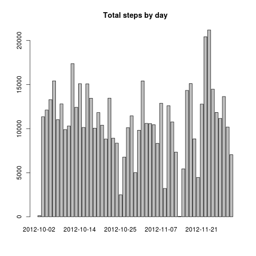
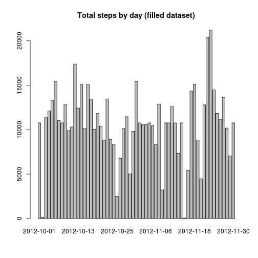
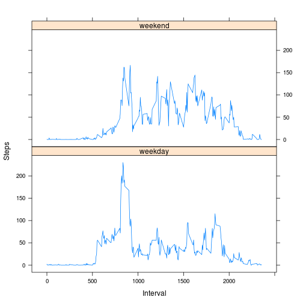

## 1- Loading and preprocessing the data

```r
setwd("/home/inigo/ReproducibleResearch/Assessment1")
df = read.csv("activity.csv")
```

## 2- Total number of steps taken per day

```r
dfByDay = aggregate(steps ~ date, df, sum)
barplot(dfByDay$steps, names.arg=dfByDay$date, main="Total steps by day")
```

 

#### 2.1- Mean

```r
cMean = mean(dfByDay$steps)
cMean
```

```
## [1] 10766
```

#### 2.2- Median

```r
median(dfByDay$steps)
```

```
## [1] 10765
```

## 3- Average daily activity pattern

```r
dfBy5Minutes = aggregate(steps ~ interval, df, mean)
plot(dfBy5Minutes$steps, type="l", names.arg=dfBy5Minutes$interval, main="Average steps by 5 minutes inteval")
```

```
## Warning: "names.arg" is not a graphical parameter
## Warning: "names.arg" is not a graphical parameter
## Warning: "names.arg" is not a graphical parameter
## Warning: "names.arg" is not a graphical parameter
## Warning: "names.arg" is not a graphical parameter
## Warning: "names.arg" is not a graphical parameter
```

 

#### 3.1- 5-minute interval containing the maximum number of steps

```r
dfBy5Minutes[with(dfBy5Minutes, order(-steps)), ][1,]
```

```
##     interval steps
## 104      835 206.2
```

## 4- Imputing missing values

#### 4.1- Total number of missing values in the dataset

```r
sum(is.na(df$steps))
```

```
## [1] 2304
```
 
#### 4.2- Fill all of the missing values in the dataset with the mean for that 5-minute interval and create a new dataset that is equal to the original dataset but with the missing data filled in.

```r
avgStep = aggregate(df$steps, df[3], mean, na.rm=TRUE)
dfTemp = merge(df, avgStep, by="interval", all.x=TRUE)
dfTemp$steps <- ifelse(is.na(dfTemp$steps), round(dfTemp$x, digits=2), dfTemp$steps)
dfFilled <- dfTemp[, -c(4)]
```

#### 4.3- Make a histogram of the total number of steps taken each day and Calculate and report the mean and median total number of steps taken per day.

```r
dfFilledByDay = aggregate(steps ~ date, dfFilled, sum)
barplot(dfFilledByDay$steps, names.arg=dfFilledByDay$date, main="Total steps by day (filled dataset)")
```

 

##### 4.3.1- Mean

```r
mean(dfFilledByDay$steps)
```

```
## [1] 10766
```

##### 4.3.2- Median

```r
median(dfFilledByDay$steps)
```

```
## [1] 10766
```


## 5- Are there differences in activity patterns between weekdays and weekends?

#### 5.1- Create a new factor variable in the dataset with two levels – “weekday” and “weekend”.

```r
dfFilled$date = as.Date(dfFilled$date, "%Y-%m-%d")
dfFilled$isWeekend = as.factor(ifelse(weekdays(dfFilled$date) %in% c("Saturday","Sunday"), "weekend", "weekday"))
```

#### 5.2- Make a panel plot containing a time series plot (i.e. type = "l") of the 5-minute interval (x-axis) and the average number of steps taken, averaged across all weekday days or weekend days (y-axis).

```r
dfFilledBy5Minutes = aggregate(dfFilled$steps, dfFilled[c(1,4)], mean)
library(lattice)
xyplot(x ~ interval | isWeekend, data = dfFilledBy5Minutes, type = "l", layout=c(1,2), xlab = "Interval", ylab = "Steps")
```

 

